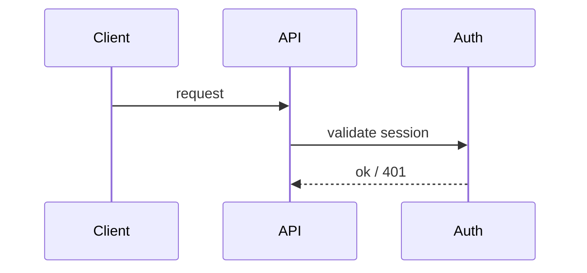

<!--
World-class page skeleton. Delete sections that do not apply to this page's
Diátaxis mode. Do not pad. Lead with the job-to-be-done. Link to source lines.
Capture intent and flow. Never paraphrase function bodies.
-->

# <Title>

> One sentence: what this system does and why a reader is here.

## In one read

The job-to-be-done: what a reader can do or understand after this page.
Use two or three sentences. Do not repeat definitions.

## How it works

The flow and the *why*. Link claims to source: see `src/auth/session.ts:42`.
Every architectural assertion must survive the accuracy oracle. If you cannot
point a skeptic at the lines, cut the claim or mark it `unverified`.

## Key pieces

- **`<Symbol / module>`** (`path:line`) — what it owns, its boundary.

## Why it is shaped this way

Record non-obvious decisions and trade-offs. Cite each with a source (commit,
ADR, comment). Unsourced rationale is a guess. Drop it or find the source.
This section is valuable and often missing. Do not skip it when the *why*
is real.

## See also

- [<Related page>](../<section>/<page>.md) — cross-links the navigability oracle
  exercises. Point the reader to the next page.
